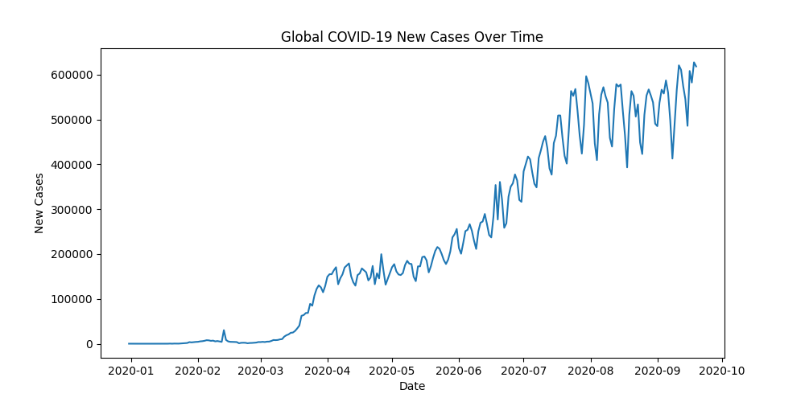
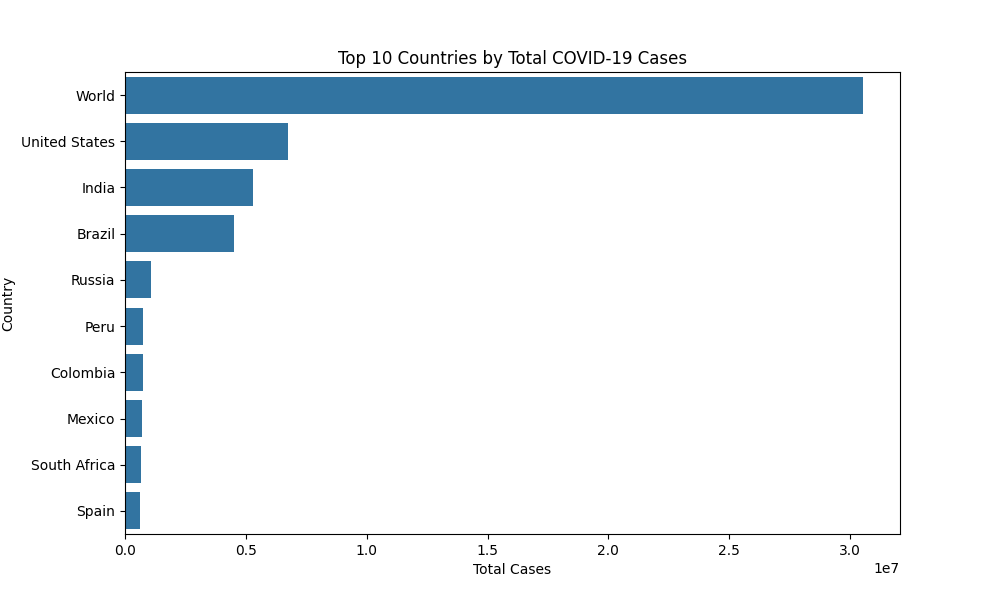
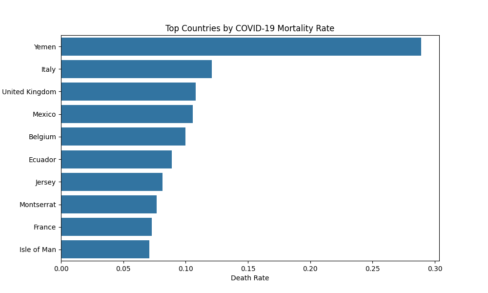
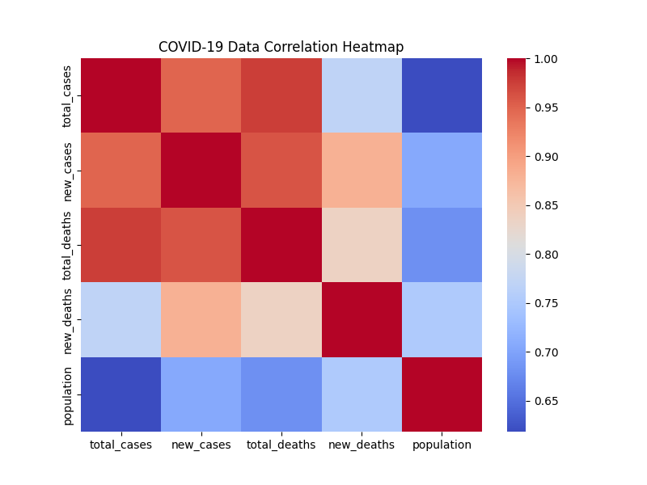

# covid19-global-data-analysis
COVID-19 global data analysis project using Python, Pandas, Matplotlib and Seaborn. Includes exploratory data analysis and visualizations of global cases, mortality rate, and country-level trends. 

## Project Overview

This project performs exploratory data analysis on global COVID-19 data to understand pandemic trends, country-level impact, and mortality patterns.

The analysis includes data cleaning, aggregation, and visualization of key metrics such as global case growth, country comparisons, and mortality rates.

The project demonstrates practical data science workflows using Python and popular data analysis libraries.

---

## Dataset

The dataset used in this project is provided by Our World in Data.

Source:
https://www.kaggle.com/datasets/owid/covid19-data

Dataset file used:
```
owid-covid-data.csv
```

---

## Technologies Used

- Python
- Pandas
- NumPy
- Matplotlib
- Seaborn

---

## Project Structure

```
covid19-global-data-analysis
│
├── covid19_analysis.py
├── owid-covid-data.csv
├── requirements.txt
├── README.md
│
└── images
     ├── cases_over_time.png
     ├── top_countries_cases.png
     ├── death_rate.png
     └── correlation_heatmap.png
```

---

## Analysis Performed

The project includes the following analyses:

### 1. Global Case Trend
Shows the progression of new COVID-19 cases worldwide over time.

### 2. Top Countries by Total Cases
Identifies the countries with the highest total case counts.

### 3. Mortality Rate Analysis
Compares countries based on COVID-19 death rates.

### 4. Correlation Analysis
Examines relationships between numerical variables such as cases and deaths.

---

## Visualizations

### Global Cases Over Time


### Top Countries by Total Cases


### COVID-19 Mortality Rate


### Correlation Heatmap


---

## Key Insights

- Global COVID-19 cases increased rapidly during major outbreak waves.
- A small number of countries contributed significantly to total case counts.
- Mortality rates varied significantly across countries.
- Strong correlations exist between infection counts and death counts.

---

## Author

Fasila Ansari
